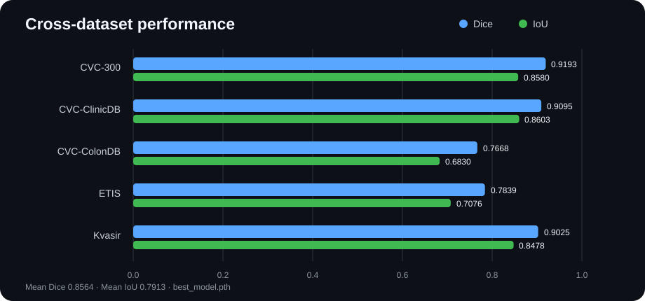
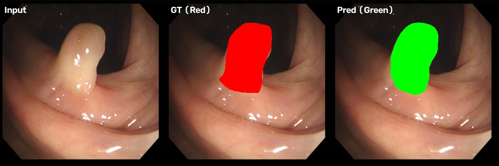
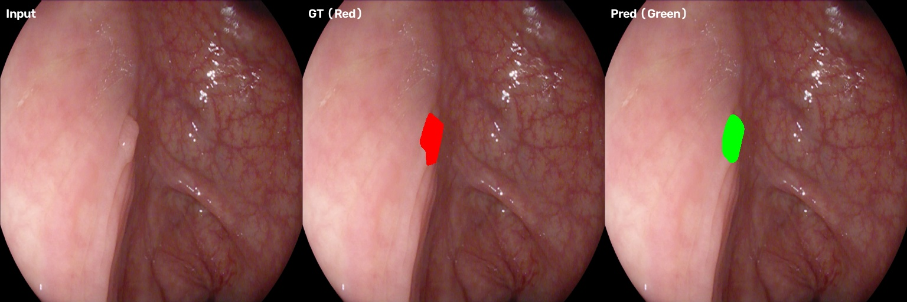
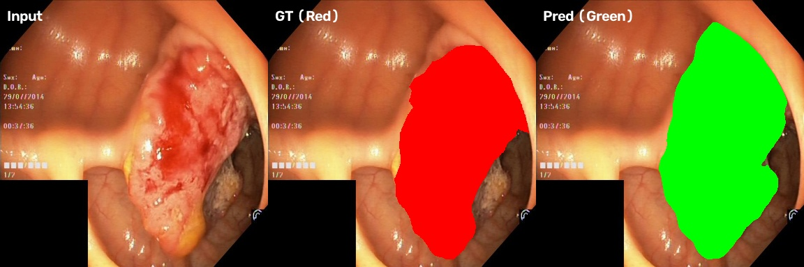

# Polyp Segmentation · 肠息肉图像分割

[](https://www.python.org/)
[](https://pytorch.org/)
[](https://developer.nvidia.com/cuda-toolkit)
[](#模型架构)

基于 **U-Net + EfficientNet-B4** 的结肠镜息肉语义分割项目。模型在 Kvasir-SEG 与 CVC-ClinicDB 混合训练集上训练，并在五个数据集上进行独立测试，以评估跨数据集泛化能力。

> 当前最佳 checkpoint：验证集 Dice **0.9036**（Epoch 39），五个测试集平均 Dice **0.8564**、平均 IoU **0.7913**。

## 可视化结果

### 跨数据集性能



### 分割示例

每张图从左到右依次为：输入图像、真实标注（红色）、模型预测（绿色）。这里同时展示高表现数据集和更具挑战的跨域数据集，避免只展示最佳样例。

<p align="center">
  <strong>CVC-300</strong><br>
  
</p>

<p align="center">
  <strong>ETIS-LaribPolypDB（高分辨率、跨域）</strong><br>
  
</p>

<details>
<summary>展开查看 Kvasir 示例</summary>

<p align="center">
  
</p>

</details>

## 测试结果

评估启用水平翻转 TTA；CVC-ColonDB 与 ETIS-LaribPolypDB 使用 512×512 推理，其余数据集使用 384×384。

| 数据集 | 样本数 | Dice ↑ | IoU ↑ | Precision ↑ | Recall ↑ |
|---|---:|---:|---:|---:|---:|
| CVC-300 | 60 | **0.9193** | 0.8580 | 0.8936 | **0.9576** |
| CVC-ClinicDB | 62 | 0.9095 | **0.8603** | 0.9316 | 0.9110 |
| CVC-ColonDB | 380 | 0.7668 | 0.6830 | 0.8716 | 0.7519 |
| ETIS-LaribPolypDB | 196 | 0.7839 | 0.7076 | 0.8048 | 0.8321 |
| Kvasir | 100 | 0.9025 | 0.8478 | **0.9472** | 0.8819 |
| **平均值** | **798** | **0.8564** | **0.7913** | — | — |

完整数值保存在 `results/summary.csv`。`results/` 默认被 Git 忽略；README 使用的精选图片位于 `docs/assets/`，可随仓库正常显示。

## 模型架构


- 架构：`segmentation_models_pytorch.Unet`
- 编码器：EfficientNet-B4，ImageNet 预训练
- 参数量：20.23M
- 损失函数：Dice Loss + Focal Loss
- 优化器：AdamW，Encoder/Decoder 使用差分学习率
- 推理：支持原始尺寸输出、水平翻转 TTA 和中文路径

## 快速开始

### 1. 创建环境

项目当前在 Windows、Python 3.12、RTX 5060 Ti 上验证通过。

```powershell
git clone https://github.com/wzjgo339/polyp-segmentation.git
cd polyp-segmentation

py -3.12 -m venv .venv-win
.\.venv-win\Scripts\Activate.ps1
python -m pip install --upgrade pip
python -m pip install -r requirements.txt
```

`requirements.txt` 默认安装 CUDA 12.8 版 PyTorch。CPU 或其他 CUDA 环境请根据 [PyTorch 安装页面](https://pytorch.org/get-started/locally/) 调整 PyTorch 安装命令。

### 2. 准备数据

数据集体积较大，不包含在 Git 仓库中。请按以下结构放置图像与二值 Mask：

```text
polyp-segmentation/
├── TrainDataset/
│   ├── image/                 # 1,450 张 RGB 图像；注意是单数 image
│   └── masks/                 # 1,450 张二值 Mask
└── TestDataset/
    ├── CVC-300/{images,masks}/
    ├── CVC-ClinicDB/{images,masks}/
    ├── CVC-ColonDB/{images,masks}/
    ├── ETIS-LaribPolypDB/{images,masks}/
    └── Kvasir/{images,masks}/
```

训练集按固定随机种子划分为 1,305 张训练图像和 145 张验证图像。Mask 会自动从 `{0, 255}` 归一化到 `[0, 1]`。

### 3. 训练

```powershell
python train.py
```

主要训练配置：

| 配置 | 当前值 |
|---|---|
| 输入尺寸 | 384×384 / 512×512 随机多尺度 |
| Batch Size | 12 |
| 最大 Epoch | 150 |
| Encoder 冻结 | 前 10 个 Epoch |
| 学习率 | Encoder `1e-4`，Decoder `1e-3` |
| 调度器 | CosineAnnealingLR |
| 混合精度 | PyTorch AMP |
| 早停 | Patience 20，监控验证集 Dice |

最佳模型保存为 `checkpoints/best_model.pth`，TensorBoard 日志保存在 `runs/`。如需从最佳权重继续训练：

```powershell
python train.py --resume
```

```powershell
python -m pip install tensorboard  # 可选，仅用于查看训练曲线
tensorboard --logdir runs
```

### 4. 评估

```powershell
python evaluate.py
```

输出包括 Dice、IoU、Precision、Recall、`results/summary.csv`，以及每个测试集的预测可视化。

### 5. 单图推理

```powershell
# 使用默认权重
python predict.py --image "path/to/image.png"

# 启用 TTA，并指定权重与输出目录
python predict.py `
  --image "path/to/image.png" `
  --weights checkpoints/best_model.pth `
  --output results/my_prediction `
  --tta
```

输出 `<name>_mask.png` 和 `<name>_result.jpg`。Windows 下包含中文字符的输入、权重和输出路径均受支持。

## 项目结构

```text
├── config.py              # 路径、训练、模型和评估配置
├── train.py               # 训练入口
├── evaluate.py            # 五数据集评估入口
├── predict.py             # 单图推理入口
├── src/
│   ├── dataset.py         # 数据读取与增强
│   ├── model.py           # 分割模型
│   ├── loss.py            # Dice/Focal 组合损失
│   ├── metrics.py         # Dice/IoU/Precision/Recall
│   ├── train.py           # 训练与验证循环
│   ├── evaluate.py        # 评估与可视化
│   ├── predict.py         # 推理流程
│   └── utils.py           # 通用及 Unicode 图像 I/O
├── docs/assets/           # README 图表与精选预测图
├── checkpoints/           # 权重文件（Git 忽略）
├── results/               # 评估输出（Git 忽略）
├── runs/                  # TensorBoard 日志（Git 忽略）
└── requirements.txt
```

## 数据增强

训练使用 Albumentations，包括随机 90° 旋转、水平翻转、平移/缩放/旋转、弹性变换、亮度与对比度扰动、轻度高斯模糊。内窥镜图像可能存在方向信息，因此未启用垂直翻转。

## 局限性

- CVC-ColonDB 和 ETIS 与训练域差异较大，指标明显低于 CVC-300、ClinicDB 和 Kvasir。
- 高分辨率图像统一缩放后可能丢失小息肉和精细边界信息。
- 训练数据仅 1,450 张，仍可能对采集设备、成像风格和病灶形态产生偏置。
- 本项目用于研究和教学，不构成医疗诊断工具，也未经过临床验证。

## 参考资料

- Jha et al., [Kvasir-SEG: A Segmented Polyp Dataset](https://datasets.simula.no/kvasir-seg/), MMM 2020
- Bernal et al., CVC-ClinicDB: A Polyp Image Database, CMIG 2015
- Tan & Le, [EfficientNet: Rethinking Model Scaling for Convolutional Neural Networks](https://proceedings.mlr.press/v97/tan19a.html), ICML 2019
- [segmentation_models.pytorch](https://github.com/qubvel-org/segmentation_models.pytorch)
